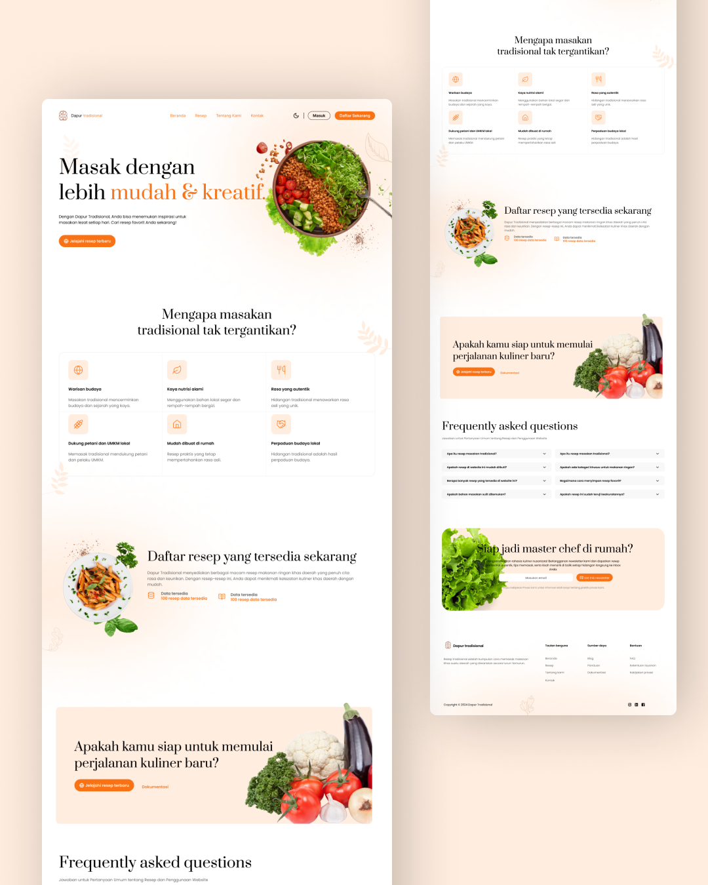
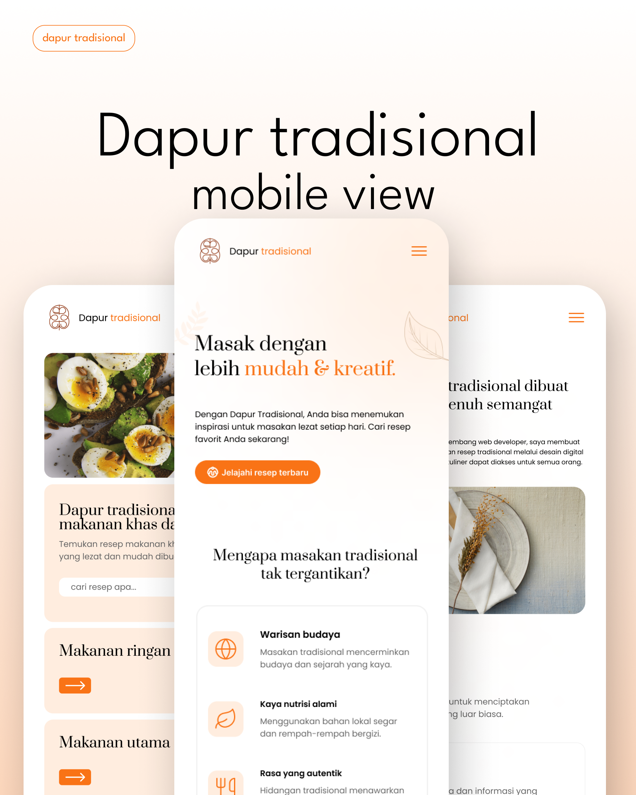

# Resep Tradisional

Selamat di **Resep Tradisional**, sebuah platform yang memungkinkan pengguna untuk menjelajahi, membuat, dan berbagi resep favorit mereka. Proyek ini dirancang untuk memudahkan pengelolaan resep dengan antarmuka interaktif untuk memasukkan bahan, langkah-langkah, dan detail lainnya.

<h3>Pratinjau website</h3>


----

<h3>Pratinjau mobile</h3>


----

## Fitur

- **Manajemen Resep**: Tambahkan, perbarui, atau hapus resep dengan mudah.
- **Input Dinamis**: Kelola bahan dan langkah-langkah dengan input yang dinamis.
- **Pilihan Kategori**: Klasifikasikan resep ke dalam kategori seperti _"Makanan Ringan"_, _"Makanan Berat"_, atau _"Kue"_.
- **Unggah Gambar**: Unggah gambar resep untuk mempercantik tampilan.
- **Formulir Interaktif**: Formulir yang ramah pengguna dengan `react-hook-form` untuk pengelolaan data yang mulus.
- **Desain Responsif**: Dioptimalkan untuk perangkat seluler dan desktop.

---

## Teknologi yang Digunakan

Website Resep ini dibangun dengan teknologi berikut:

- **Frontend**: Reactjs, TypeScript, Tailwindcss
- **Backend**: ExpressJs
- **Manajemen Formulir**: `react-hook-form`, `@hookform/resolvers`
- **Ikon**: `lucide-react`
- **Komponen**: Komponen UI Kustom

---

## Getting Started
Untuk memulai, Anda cukup mengkloning repositori `recipe-managements` ini dan menginstal dependensi.

Klon repositori `recipe-managements` menggunakan git:
```bash
git clone https://github.com/AhmadJanuarr/dapur-tradisional.git
cd dapur-tradisional
```

Instal dependensi dengan perintah ini:
```bash
npm install
```

Jalankan aplikasi dengan perintah ini:
```bash
npm start
```